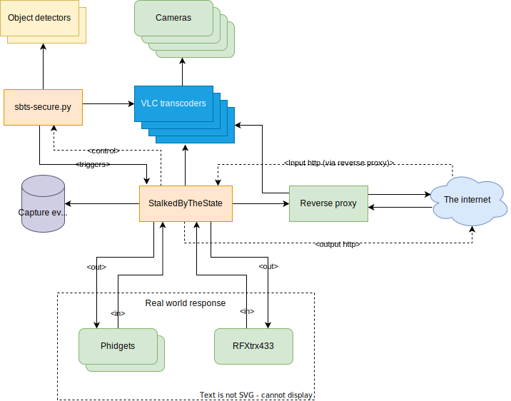

# sbts-install

The installer for the StalkedByTheState project

## A little history... ##

Hi, my name is **Kim Hendrikse**. This project actually started in 2005 when a series of events put the security of me and my family in danger. The impact of this effectively hijacked my life for the following 18 years, making me somewhat security obsessed. This project evolved throughout that time as a result.

The project started in earnest in 2008 when I started on a Java based alerter and series development started and was finished in 2011 when I worked together with a frontend developer every weekend for between 6-12 months.

Operation primarily involved the use of PIR sensors until 2019 when NVidia released the **Jetson** Nano making it possible to run a full sized version of YoloV3 as a security appliance. Though it's still possible to trigger from devices like PIR sensors, the emergence of computer vision effectively obsoleted them for most purposes.

Over time I have been pivoting away from strict security use cases towards **Wildlife Preservation** efforts. Recently I integrated [DeepFaune](https://www.deepfaune.cnrs.fr/en/), a model developed in co-operation with over 40 partners for detecting and classify many European fauna including Wolves, Bears, Lynxes, deer etc. The release of this will coincide with the release to fully support the Orin platforms. With likely a **Raspberry Pi** version also coming if feasible.

The integration of deepfaune and other models for animals involved in human/wildlife conflict create for a platform with realistic chances of providing a longish distance early warning detection. In case of wolves in the Netherlands, a beacon of hope for farmers who would in principle be in favour of co-existence in with wildlife but have no tools to help them protect their livestock.

## Development status ##

**Note: I'm still working on the install for Orin series computers**

## StalkedByTheState Architecture ##


Installs the latest release of StalkedByTheState on Jetson platforms.

The following platforms are currently supported:

Jetson **Nano**, Jetson **NX**, Jetson **AGX**, Jetson **Orin Nano**, Jetson **Orin AGX** on both **jetpack 4.6 and 5.x**



RTSP from the cameras is transcoded into MJPEG over http for the video alert capture and for reading by sbts-secure.py.

sbts-secure.py reads images from the vlc transcoders in turn and sends the latest image to the object detectors via a websocket connection and receives the result json. This is processed in combination with the configuration that defines the zone polygons and responses and generates triggers to the StalkedByTheState state machine for further processing.

StalkedByTheState is a highly flexible state machine and be configured to capture video events generated by the triggers and generate alert rest calls and E-mails.

Real world responses can be generated and read by the USB connected Phidget I/O controllers. In Europe, the RFXtrx433 which can talk to KlikAanKlikUit lights and remote controls in Europe.

The system sets up the scripting to maintain auto-renew LetsEncrypt certificates if desired.

The intention is that the whole system runs on top of a read-only mounted memory overlay file system which provides resilients from uncontrolled power cycles.

Currently StalkedByTheState installs the following object detectors by default (Based on memory capacity of the platform)

* **[Yolov7](https://github.com/WongKinYiu/yolov7) (Chien-Yao Wang, Alexey Bochkovskiy, Hong-Yuan Mark Liao)**
* **[YoloV4](https://github.com/AlexeyAB/darknet) (Alexey Bochkovskiy)**
* **[YoloV3](https://pjreddie.com/darknet/yolo/) (P.J. Reddie)**

## What is StalkedByTheState ? ##

StalkedByTheState is a highly effective proactive/preventative home and business security system that installs to a
production ready appliance in just a couple of commands.

See the introduction video for the overview: https://www.youtube.com/watch?v=XVkhnawBvXc

By system I mean everything.

* Security state machine that records triggered video events. Supports time of day/day of week scheduled events. Watchdog timers,
rate based triggers, synthetic combination events.
* multi-model CNN scanner that can use multiple AI models within the same image even. You
can choose to use yolov7 in one part of an image, yolov4 in another, or choose to have to triggered confirmed with both.
Or either... or several more. Object detection is done via a network service over a websocket so you can add external models to your appliance
if you like, or models that are not yolo-like object detectors so long as you provide a websocket wrapper service.
* Support for negative matching. i.e. notify if you don't see an object in an image
* Scanner that reads camera frames, detects objects and then matches them for triggers can be dynamically enabled and disabled, either
at the whole camera level or down to a specific notification level
* Support for auto-renew letsencrypt certificates. Can be setup as a reverse proxy to tunnel access to StalkedByTheState
and your cameras and other devices over https
* Elicit a real-world response. Supports out of the box Phidget Interfacekit USB I/O controllers for switching relays or
reading switches, smoke/carbon monoxide detectors and other wired sensors. Read responses from commonly available remote controls
such as from Klikaanklikuit in the Netherlands. Or control klikaanklikuit devices.
* Builtin Certificate manager. GUI controlled generation of X509 certificates and importing and exporting of certificates. Use
self-signed certificates or real ones. Use https internally for device-device communications
* Websocket based event subscribe interface
* Resilient mode of operation that runs the OS in read-only mode with a read-write memory overlay layer and the configuration
stays read-only till it needs updating. Auto-repair on boot so no hung appliances (Waiting for keyboard input for repair).
* Runs off SSD

## Installation ##

**Installs in just a couple of commands**

View the installation in real-time in video here: https://www.youtube.com/watch?v=FrfCRfXJAvw

**First**

Disable the gui login:

```
sudo systemctl set-default multi-user.target
sudo reboot
```

**Then**

Install the sbts-base project from here:

https://github.com/hcfman/sbts-base

The sbts-base project creates partitions on the SSD disk, copies the OS to the SSD and configures the boot to SSD changes.

**Then**:

Run the main install script:

```
git clone https://github.com/hcfman/sbts-install.git
cd sbts-install
sudo -H ./sbts_install_stalkedbythestate.sh
```

Answer "No" (The default) to the question relating to automatically restarting the docker daemon. The whole system will be installed and reboot, after which the system will be running the software.

At the moment you have to enter "admin" as the web username. I'll fix this later.

To view the user interface type in:

```
http://your-ip-address:8080/sbts/
```

with the account details you entered when installing.

For detailed tutorials about using this software please view my YouTube channel

https://www.youtube.com/channel/UCXn7Z37_xwuxLPpcPTtdNRQ

where installation and configuration videos are available and with new ones being added regularly.

Kim Hendrikse
