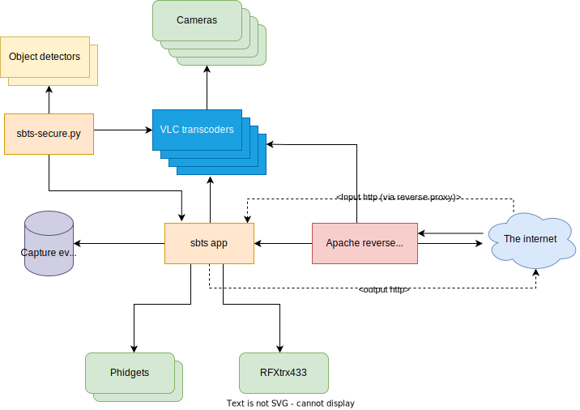

# sbts-install

Installs the latest release of StalkedByTheState on one of NVIDIA Jetson Nano, NX or AGX.

## Whatis StalkedByTheState ? ##

StalkedByTheState is a highly effective proactive/preventative home and business security system that installs to a
production ready appliance in just a couple of commands.

See the introduction video for the overview: https://www.youtube.com/watch?v=XVkhnawBvXc

By system I mean everything.

* Security state machine that records triggered video events. Supports time of day/day of week scheduled events. Watchdog timers,
rate based triggers, synthetic combination events.
* multi-model CNN scanner that can use multiple AI models within the same image even. Yolo currently installs yolov4, yolov4, scaled-yolov4, yolor and yolov7 (Chien-Yao Wang, Alexey Bochkovskiy, Hong-Yuan Mark Liao). You
can choose to use yolov7 in one part of an image, yolov4 in another, or choose to have to triggered confirmed with both.
Or either... or several more. Classification is done via a network service over a websocket so you can add external models to your appliance
if you like, or models that are not yolo-like object detectors so long as you provide a websocket wrapper service.
* Scanner that reads camera frames, classifies them and then matches them for triggers can be dynamically enabled and disabled, either
at the whole camera level or down to a specific notification level
* Support for auto-review letsencrypt certificates. Can be setup as a reverse proxy to tunnel access to StalkedByTheState
and your cameras and other devices over https
* Elicit a real-world response. Supports out of the box Phidget Interfacekit USB I/O controllers for switching relays or
reading switches, smoke/carbon monoxide detectors and other wired sensors. Read responses from commonly available remote controls
such as from Klikaanklikuit in the Netherlands. Or control klikaanklikuit devices.
* Builtin Certificate manager. GUI controlled generation of X509 certificates and importing and exporting of certificates. Use
self-signed certificates or real ones. Use https internally for device-device communications
* Websocket based event subscribe interface
* Resilient mode of operation that runs the OS in read-only mode with a read-write memory overlay layer and the configuration
stays read-only till it needs updating. Auto-repair on boot so no hung appliances (Waiting for keyboard input for repair).
* Runs off SSD

## StalkedByTheState Architecture ##



## Installation ##

**Installs in just a couple of commands**

View the installation in real-time in video here: https://www.youtube.com/watch?v=FrfCRfXJAvw

**First** you need to have installed the sbts-base project from here

https://github.com/hcfman/sbts-base

**Then**:

If you have a Jetson Nano, then you should disable the GUI interface first with:

```
sudo systemctl set-default multi-user.target; sudo reboot
```

```
git clone https://github.com/hcfman/sbts-install.git
cd sbts-install
sudo -H ./sbts_install_stalkedbythestate.sh
```

Answer "No" (The default) to the question relating to automatically restarting the docker daemon. The whole system will be installed and reboot, after which the system will be running the software.

To view the user interface type in:

```
http://your-ip-address:8080/sbts/
```

with the account details you entered when installing.

For detailed tutorials about using this software please view my YouTube channel

https://www.youtube.com/channel/UCXn7Z37_xwuxLPpcPTtdNRQ

where installation and configuration videos are available and with new ones being added regularly.

Kim Hendrikse
